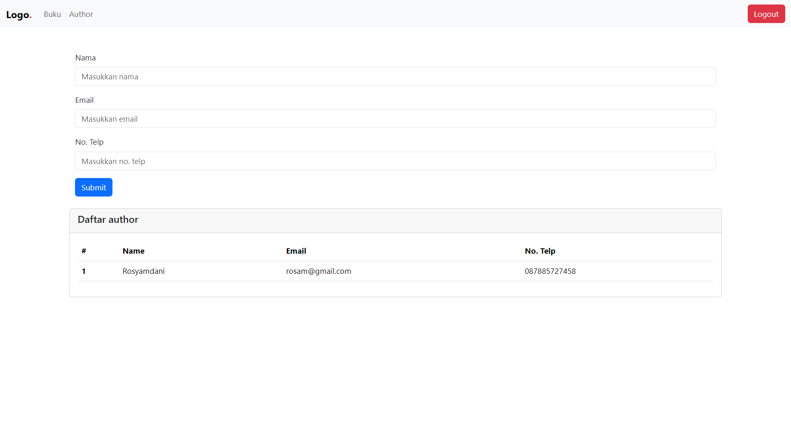
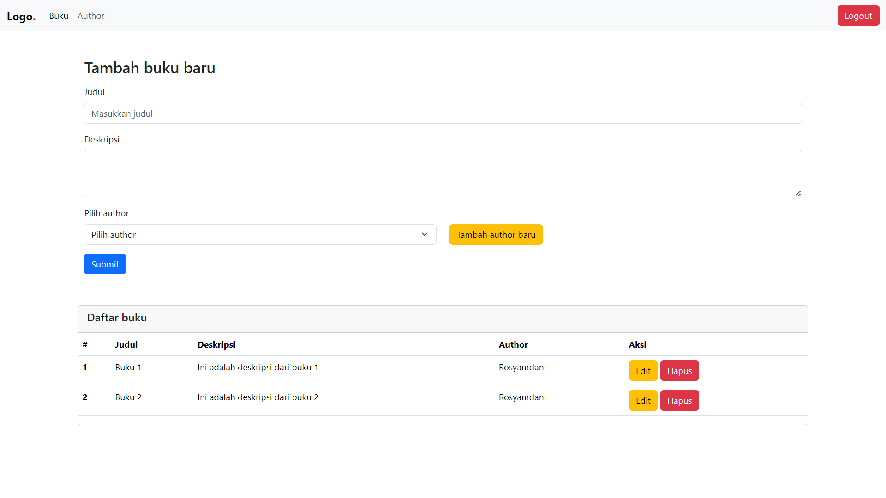

# Sistem Manajemen Buku dan Author

## 1. Penjelasan Proyek
Proyek ini adalah sistem manajemen buku dan author berbasis web yang menyediakan fitur-fitur berikut:
- Menambah, mengedit, dan menghapus data author
- Menambah, mengedit, dan menghapus data buku
- Melihat daftar atau detail author dan buku melalui API

Sistem ini bertujuan untuk memudahkan pengelolaan buku dan author, serta menyediakan API yang dapat diintegrasikan dengan aplikasi lain untuk mengakses data buku atau author.

## 2. Desain Database
Sistem ini menggunakan database relasional untuk mengelola data buku dan author. Berikut adalah skema database yang digunakan:

### Tabel Authors (Penulis)
| Kolom         | Tipe Data    | Deskripsi                         |
|---------------|--------------|-----------------------------------|
| id            | INT          | Primary key, auto-increment       |
| name          | VARCHAR(255) | Nama penulis                      |
| bio           | TEXT         | Biografi penulis                  |
| nationality   | VARCHAR(100) | Kewarganegaraan penulis           |
| created_at    | TIMESTAMP    | Tanggal dan waktu data dibuat     |

### Tabel Books (Buku)
| Kolom         | Tipe Data  | Deskripsi                             |
|---------------|------------|---------------------------------------|
| id            | INT        | Primary key, auto-increment           |
| title         | VARCHAR(255) | Judul buku                          |
| author_id     | INT        | Foreign key, mengacu ke tabel authors |
| genre         | VARCHAR(100) | Genre buku                          |
| published_at  | DATE       | Tanggal terbit buku                   |
| created_at    | TIMESTAMP  | Tanggal dan waktu data dibuat         |

## 3. Screenshot Aplikasi

### Halaman Manajemen Author


### Halaman Manajemen Buku


## 4. Dependency
Proyek ini dibangun menggunakan teknologi berikut:

- **Backend**: 
  - PHP (Laravel)
  - Composer untuk manajemen dependency
- **Frontend**: 
  - HTML, CSS, JavaScript
  - Bootstrap untuk desain responsif
- **API**:
  - RESTful API dengan response format JSON untuk data buku dan author
- **Database**: MySQL

## 5. Endpoint API

- **Mendapatkan semua author**: `GET /api/authors`
- **Mendapatkan author berdasarkan ID**: `GET /api/authors/{id}`
- **Mendapatkan semua buku**: `GET /api/books`
- **Mendapatkan buku berdasarkan ID**: `GET /api/books/{id}`

## 6. Informasi Tambahan
- Pastikan file `.env` sudah dikonfigurasi dengan benar untuk koneksi database dan pengaturan API.
- Sistem menggunakan autentikasi Laravel untuk mengatur akses API.
- Untuk menjalankan proyek ini, gunakan perintah berikut:

```bash
composer install
php artisan migrate
php artisan serve
